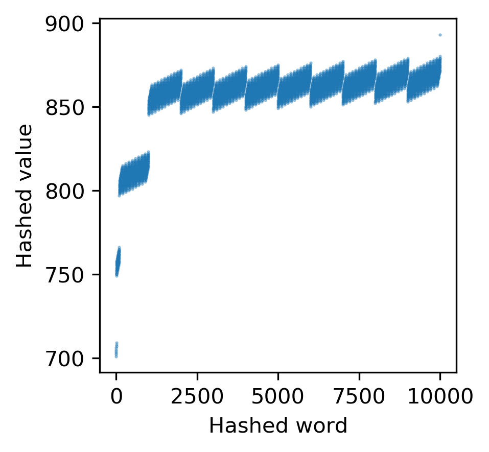

# Hash tables

## Introduction

The purpose of this program is to benchmark and compare various hashing methods and collision strategies. It utilizes the following files:

- README.md: This file
- hash_functions.py: A module containing three hash functions.
- hash_tables.py: The main script, contains collision resolution strategies and argument parsing.
- scatter.py: A matplotlib based module for creating a scatterplot.

Tests are included in the following files

- fxn_tests.sh: Bash functional testing using sssh.
- test_hash_functions.py: Unittesting for hash_functions.py
- test_hash_tables.py: Unittesting for hash_tables.py

Data used for this program are included in the files:

- non_rand_words.txt: a list of non-random words
- rand_words.txt: a list of random words

Please note the directory:

- img: contains images referenced in benchmarking.

## Hash Functions

As hash functions, I implemented `h_ascii`, `h_rolling`, and `h_fletcher64`.

### Ascii hashing

Parses strings based on their ascii values and direcly assigns hash index. Relies on python function `ord()`.

### Rolling hash

Assigns a rolling hash based on ascii values. Relies on python function `ord()`.

### Fletcher 64 Checksum [Extra Credit Assignment]

Fletcher's checksum (<https://en.wikipedia.org/wiki/Fletcher%27s_checksum>) is an algorithm for computing a position-dependent checksum. It was developed by John Fletcher at Lawrence Livermore National Labs. Fletcher-64 divides a data word into two 32-bit blocks. Two 32-bit sums result and are combined into a 64-bit Fletcher checksum. The second sum is multiplied by 2^32 and added to the simple checksum. The modulus of 4,294,967,295 is applied.

An important weakness to note is that the Fletcher checksum cannot distinguish between blocks of all zeros and blocks of all 1 bits.

## Hash Tables & Collision Resolution

Three methods of collision resolution are used

1. Chain Hashing
2. Linear Probing
3. Quadratic Probing [Extra Credit Assignment]

### Chain Hashing

Involves the creation of nested lists at hash indices where a collision occurs.

### Linear Probing

When a collision occurs, the key, value pair is appended wherever the next empty slot exists. Proceeds linearly.

### Quadratic Probing

When a collision occurs, the key, value pair is appended wherever the next empty slot exists. Proceeds according to a quadratic function. `query = (hash_slot + i**k) % self.N` where the exponent k increases incrementally.

## Results

 Ascii, non random words  Ascii, random words  Fletcher64 checksum, random words  Fletcher64 checksum, non_random words.  Non random words, rolling hash.  Random words, ascii  Random words, rolling_hash

### Installation

The following builtin python libraries are used:

- os
- sys
- argparse
- random
- time

pycodestyle is required to run the verification tests: `pip install pycodestyle pip install --upgrade pycodestyle pip uninstall pycodestyle`

Future functional testing may involve ssshtest, which can be installed with: `test -e ssshtest || wget -qhttps://raw.githubusercontent.com/ryanlayer/ssshtest/master/ssshtest . ssshtest`

Matplotlib is required and can be installed with: `conda activate swe4s conda install matplotlib`
